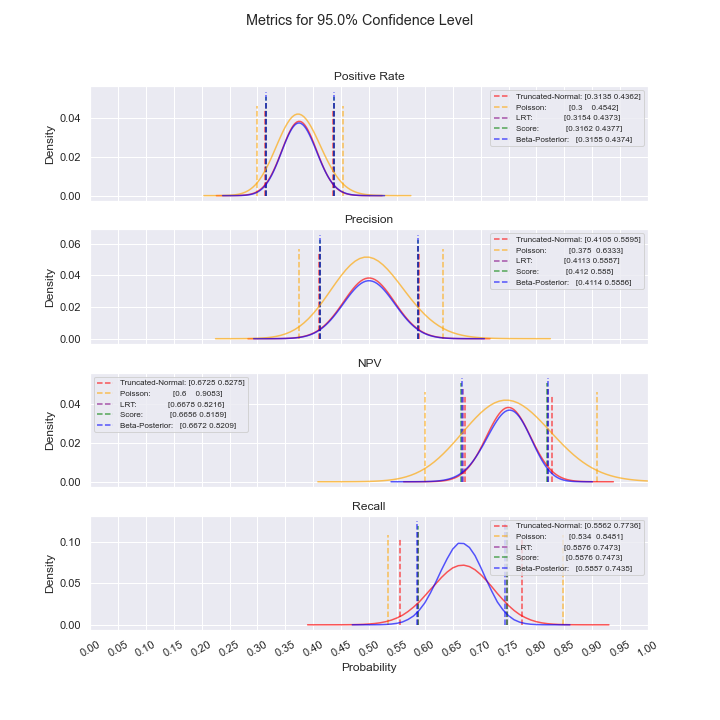

[](https://travis-ci.com/kennethschen/Classification-Confidence-Intervals)
[](https://codecov.io/gh/kennethschen/Classification-Confidence-Intervals)

# Classification Confidence Intervals

A package to calculate confidence intervals for classification positive rate, precision, NPV, and recall using a labeled sample of the population via exact & approximate Frequentist & Bayesian setups.

## Summary

### Description

Precision and recall are important metrics for evaluating classification model performance;
however, they are only calculable from labeled data. In situations with unlabeled data, especially
with large datasets or datastreams where labeling and remediating flagged points is incredibly
expensive, exact precision and recall are not obtainable. There are solutions to calculating
population precision and recall confidence intervals in such cases using a labeled sample of the
entire dataset, but much of this information is scattered. This package combines Frequentist and
Bayesian statistical approaches to produce various confidence intervals and present a holistic
picture into model performance and dataset quality.

### Metrics

The classification metrics for which confidence intervals are constructed are defined here.
These metrics are also our parameters of interest in the models.

Let TP, FP, TN, FN mean true positives, false positives, true negatives, and false negatives,
respectively.

* **Positive Rate:** (TP+FN) / (TP+FN+FP+TN)
* **Precision (PPV):** (TP) / (TP+FP)
* **Negative Predictive Value (NPV):** (TN) / (TN+FN)
* **Recall** (TP) / (TP+FN)

If helpful, see the precision recall image [here](https://github.com/kennethschen/Classification-Confidence-Intervals/blob/master/images/precision_recall_image.png).

## Usage

The relevant class is [**ClassificationConfidenceIntervals**](https://github.com/kennethschen/Classification-Confidence-Intervals/blob/master/src/classification_confidence_intervals.py).

### Installation

```
$ pip install classification-confidence-intervals
```

[PyPI](https://pypi.org/project/classification-confidence-intervals/)
[GitHub](https://github.com/kennethschen/Classification-Confidence-Intervals)


### Instantiation

During instantiation, all distributions are fitted. By default, **exact_precision**=None.

Args:
* **sample_labels (list):** Binary labels of datapoints in sample, with labels as boolean or
    binary in [0,1] or in [-1,1].
* **sample_predictions (list):** Binary labels of datapoints in sample flagged as positives
    by algorithm, with labels as boolean or binary in [0,1] or in [-1,1].
* **population_size (int):** Size of population.
* **population_flagged_count, (int):** Number of datapoints in population flagged as positives
    by algorithm.
* **confidence_level (float):** Confidence level, equal to area desired under curve.
* **exact_precision (float):** If provided, the actual population precision.

```python
>>> from classificationconfidenceintervals import ClassificationConfidenceIntervals
>>> confidenceintervals = ClassificationConfidenceIntervals(
...     sample_labels=[1, 1, 1, 0, 0, 0, 0, 0] * 30,
...     sample_predictions=[1, 1, 0, 0, 1, 1, 0, 0] * 30,
...     population_size=4000,
...     population_flagged_count=2000,
...     confidence_level=0.95,
... )
```

With regards to your labled sample, in the example above using fake labels and predictions,
**sample_labels** refer to the truth values of each datapoint (the 1st to 3rd datapoint are
positives; the 4th to 8th datapoints are negatives). **sample_predictions** refer to whether or not your
algorithm flagged each datapoint (the 1st, 2nd, 5th, and 6th datapoints were flagged; the 3rd, 4th, 7th, and 8th
datapoints were not flagged). The arrays are artificially duplicated by a factor of 30 in the example. Do not do this in practice.

With regards to your population, the only information required are **population_size** and
how many points your algorithm flags in the population as **population_flagged_count**. In the
example above, and the algorithm flagged 2000 datapoints among the 4000 datapoints in the population.

Degenerate samples cause the models to become degenerate, and instantiation will throw errors if
your sample does not include at least one of each of TP, FP, TN, FN.

**confidence_level** by convention should generally be set at .95. The higher the value,
the wider the confidence intervals.

In cases where all flagged datapoints in the population have been remediated (i.e. are labeled),
you may provide the **exact_precision** value during instantiation; otherwise, confidence intervals
will also be created for precision. A case where not all flagged datapoints in the population
are remediated is when the total number of flagged items is simply too large and only a subset
of them have been remediated.

Your sample size should be sufficiently large to make the confidence intervals narrow.
See the [appendix](#sample-size-and-margin-of-error) below.

### Getting Confidence Intervals

After instantiation, calculations for confidence intervals can now be performed via the **get_cis()**
method. By default, **n_iters**=1000000 and **plot_filename** is an empty string.

Args:
* **n_iters (int):** Number of iterations to simulate posterior models.
* **plot_filename (str):** If not empty, save plots using filename as relative path.

Returns:
* **pos_rate_cis (CIDataClass):** Confidence intervals for pos rate based on multiple methods.
* **ppv_cis (CIDataClass):** Confidence intervals for precision based on multiple methods.
* **npv_cis (CIDataClass):** Confidence intervals for NPV based on multiple methods.
* **recall_cis (CIDataClass):** Confidence intervals for recall based on multiple methods.


```python
>>> pos_rate_cis, ppv_cis, npv_cis, recall_cis = confidenceintervals.get_cis(n_iters=100000, plot_filename='example_metrics_plot')
>>> print(pos_rate_cis)
read_only_properties.<locals>.class_rebuilder.<locals>.CustomClass(tnorm_ci=(0.31375112548312334, 0.43624887451687666), poisson_ci=(0.3, 0.45416666666666666), lrt_ci=(0.3154, 0.4373), score_ci=(0.3162, 0.43770000000000003), posterior_ci=(0.3155447558316776, 0.4374497740783102), simulated_ci=(0.3159835357403228, 0.4374219880675257))
>>> print(ppv_cis)
read_only_properties.<locals>.class_rebuilder.<locals>.CustomClass(tnorm_ci=(0.41054029281414217, 0.5894597071858578), poisson_ci=(0.375, 0.6333333333333333), lrt_ci=(0.4113, 0.5887), score_ci=(0.41200000000000003, 0.588), posterior_ci=(0.41143373746262163, 0.5885662625373784), simulated_ci=(0.4119916854809507, 0.5890112681445884))
>>> print(npv_cis)
read_only_properties.<locals>.class_rebuilder.<locals>.CustomClass(tnorm_ci=(0.6725256210456648, 0.8274743790402173), poisson_ci=(0.6, 0.9083333333333333), lrt_ci=(0.6678000000000001, 0.8216), score_ci=(0.6656, 0.8189000000000001), posterior_ci=(0.667214568760124, 0.8208930781209349), simulated_ci=(0.6675875145345339, 0.8210540703047337))
>>> print(recall_cis)
read_only_properties.<locals>.class_rebuilder.<locals>.CustomClass(tnorm_ci=(0.5562766006133449, 0.7735840644338399), poisson_ci=(0.4838709677419355, 0.8735632183908046), lrt_ci=(0.5531943510423672, 0.767435797158128), score_ci=(0.5519828510182208, 0.7645299700949162), posterior_ci=(0.5528394789668374, 0.7666885785320019), simulated_ci=(0.5856829486565244, 0.7438937436565682))
```

The **CIDataClass** is a modified class that supports dot notation access and forces the returned
confidence intervals to be read-only.

```python
>>> print(pos_rate_cis.tnorm_ci)
(0.31375112548312334, 0.43624887451687666)
>>> pos_rate_cis.tnorm_ci = tuple([.5, .8])
AttributeError: Can't modify tnorm_ci
```

For variable access, a **get()** method is provided as well in **CIDataClass**.

```python
>>> key = "tnorm_ci"
>>> print(pos_rate_cis.get(key))
(0.31375112548312334, 0.43624887451687666)
```

### Visualization

If **plot_filename** is not an empty string when running **get_cis()**, you will have an image file
located at **plot_filename**.png. An example is provided below.




### Interpretation

Let *p* be the probability for a metric. There are three cases to consider.

* *p* is not close to 0 nor 1: Ensure that the non-Poisson confidence intervals are similar before using
any of the non-Poisson confidence intervals (as they are all similar).
    * If non-Poisson confidence intervals are not similar, then include more labeled samples as inputs
    to the class. This helps to ensures that all non-Poisson methods agree
    asymptotically on the confidence intervals.

* *p* is close to 0: Use the Poisson confidence intervals.
    * Increasing the labeled sample size does not necessarily ensure that non-Poisson models will agree
    asymptotically on what the confidence intervals should be.
    See the [appendix](#examples-of-extreme-values-of-p) for more details.

* *p* is close to 1: Use one of the non-Truncated-Normal/non-Poisson confidence intervals.
    * Increasing the labeled sample size does not necessarily ensure that non-Truncated-Normal/non-Poisson
    models will agree asymptotically on what the confidence intervals should be.
    See the [appendix](#examples-of-extreme-values-of-p) for more details.

## Models

For the four metrics of interest, the following models are used. Please note that all models
are fitted for **Positive Rate**, **Precision**, and **NPV**. The only
model used for **Recall** is the Simulated Distribution. As discussed [below](#Confidence-Interval-Methods),
no parametric distributions can be fit on recall due to independence constraints for calculating confidence
intervals.

### Frequentist Models:

#### Exact distribution:

The exact underlying model fits the story of a binomial distribution. From some total sample size,
each item in that sample has some probability of being a success or a failure.

* **Binomial**: Binomial distribution.

#### Approximating distribution:

These models approximate the exact binomial distribution as the sample size grows.

* **Truncated-Normal**: A normal distribution truncated to (0, 1). Theoretically preferred if
the estimate for the parameter is not close to 0 nor 1.
* **Poisson:** Poisson distribution. Theoretically preferred if
the estimate for the parameter is close to 0.

### Bayesian Models

#### Exact distribution:

While Frequentist statistics view estimates for the parameter as completely determined by observed data,
Bayesian statistics models the parameter with a prior belief via a distribution that causes the parameter
to depend on both the prior belief and the observed data. A flat prior of Beta(.5,.5)
is used in this package.

* **Beta-Posterior:** A Beta-Posterior distribution with the Beta distribution as the conjugate
    prior to the Binomial distribution.

#### Approximating distribution:

This model approximates the Beta-Posterior distribution as the number of Monte Carlo draws grows.

* **Simulated Distribution:** A non-parametric distribution created from Monte Carlo samples from the
Beta-Posterior distribution.

## Confidence Interval Methods

The models above are used to obtain confidence intervals for each of the metrics in three ways.
For ease of discussion, confidence intervals also refer to credible intervals under the Bayesian
framework. This section focuses on derivations, not proofs, the latter of which are
readily available at online sources.

### Distributional Confidence Intervals (Truncated-Normal, Poisson, Beta-Posterior)

#### Positive Rate, Precision, and NPV

Given *c*=**confidence_level**, confidence intervals are drawn from the quantiles of the model's
probability mass/density function such that the center (**confidence_level**)% of area lies
within the confidence interval.

For the Poisson model, an extra adjustment is performed.
The support represents the count of successes and is divided by
the model's relevant sample size to map to proportions;

<p align="center"></p>

#### Recall

For recall, let *X<sub>m* be the precision distribution under model *m* and
*Y<sub>m* be the NPV distribution under model *m*. Let *N* be the population size. Let
*N<sub>f* be number of datapoints in population flagged as positives by the algorithm.
Then, for model *m*, the population recall is
*X<sub>m* *N<sub>f* / (*X<sub>m* *N<sub>f* + *Y<sub>m* (*N*-*N<sub>f*)).

There is no clean distributional form for recall due to dependence between the numerator and denominator,
but the confidence interval for recall is obtainable by optimizing
for the endpoints of the confidence interval for recall using *X<sub>m* and *Y<sub>m*.
Let *X<sub>m,l* and *X<sub>m,h* be the respective lower and upper bounds of the confidence interval
for *X<sub>m*. Then the confidence intervals for population recall are:

<p align="center"></p>

Independence between *X<sub>m* and *Y<sub>m* grants the ability to use each each distribution's confidence intervals without
concern for dependence effects. Had recall been defined as **precision** / **positives**, the
parameters of the two distributions are not independent and confidence intervals could not
be created in the above manner.

### Hypothesis Test Inversion Confidence Intervals (Binomial)

#### Positive Rate, Precision, and NPV

Confidence intervals are created by inverting the Binomial Likelihood
Ratio Test (LRT) and Score Test. Considering only the parameter values for where the test statistic does
not lie in the rejection region determined by **confidence_level**, we take the min and max of
those values to get confidence intervals.

Let *n* be the number of observations and *y* be the number of successes.
The binomial loglikelihood and score function are respectively defined as:

<p align="center"></p>

Then the LR test statistic and Score test statistic respectively are:

<p align="center"></p>

Under the null hypothesis:

<p align="center"></p>

Invoking a one-sided test on the chi-squared distribution letting *c* = **confidence_level**,
the confidence intervals for the LRT and Score Test are respectively given by taking the min and max of:

<p align="center"></p>

#### Recall

For recall, the same logic follows as for distributional confidence intervals.

### Simulated Confidence Intervals (Simulated)

#### Positive Rate, Precision, and NPV

Given **confidence_level**, confidence intervals are drawn from the quantiles of the Monte Carlo
simulated draws from the Beta-Posterior such that the center (**confidence_level**)% of area lies
within the confidence interval.

#### Recall

For recall, let *p|X* be the Beta-Posterior distribution for precision,
where *X* is the observed binary labeled data, as such:

<p align="center"></p>

Let *p|Y* similarly be the Beta-Posterior distribution for NPV.

Let *R<sup>(i)* be the *i*'th Monte Carlo sample value for population recall. Let *N* be the population size. Let
*N<sub>f* be number of datapoints in population flagged as positives by the algorithm.
Then, based on the independent draws for *p|X* and *p|Y* on the *i*'th iteration:

<p align="center"></p>

from which quantiles are drawn.

## Appendix

### Sample Size and Margin of Error

Under the convention of **confidence_level**=.95, the plot below shows the necessary sample size
for a particular proportion to have a certain margin of error under a Wald confidence interval
(Normal model). Margin of error gives the number of percentage points (on a decimal scale)
from the estimate of the proportion to the confidence interval endpoint on either side of the estimate.

With a desired Margin of Error *M*, one can invert the equation for the spread in a Wald confidence
interval to solve for sample size *n*. Since the true parameter *p* is unknown, to be conservative
and maximize the required sample size, *p* is set to .5.

<p align="center"></p>

<p align="center"></p>

### Examples of Extreme Values of *p*

```python
>>> # estimate near 0
>>> for n in [10, 100]:
...     module = ClassificationConfidenceIntervals(
...         sample_labels=[0] * n + [1] + [1] * n + [0],
...         sample_predictions=[1] * (n + 1) + [0] * (n + 1),
...         population_size=4000,
...         population_flagged_count=200,
...         confidence_level=0.95,
...     )
...     module.get_cis(plot_filename=f"near_0_n={n}")

>>> # estimate near 1
>>> for n in [10, 100]:
...     module = ClassificationConfidenceIntervals(
...         sample_labels=[1] * n + [0] + [0] * n + [1],
...         sample_predictions=[1] * (n + 1) + [0] * (n + 1),
...         population_size=4000,
...         population_flagged_count=200,
...         confidence_level=0.95,
...     )
...     module.get_cis(plot_filename=f"near_1_n={n}")
```

<p align="center">
    
    
</p>

For the case above where precision and NPV are low, notice how the Truncated-Normal confidence
intervals include negative values, rendering Truncated-Normal unusable in this situation.
Even as sample size increases, this issue persists; additionally, we do not see convergence
of the confidence intervals. As such, the best model to use is Poisson.

<p align="center">
    
    
</p>


For the case above where precision and NPV are high, notice how the Truncated-Normal and Poisson
confidence
intervals include values above 1, rendering them unusable in this situation.
Even as sample size increases, this issue persists; additionally, we do not see convergence
of the confidence intervals. As such, one of the other models should be used (LRT or Bayesian).

### Comparison of Wald, LRT, and Score Confidence Intervals

* Wald (Truncated-Normal): Inflates Type I error because standard error is calculated under the alternative.
* LRT (Binomial): Conserves Type I error and power.
* Score (Binomial): Less powerful than LRT but more robust than Wald.

Generally, LRT is the best choice among Frequentist confidence intervals.
